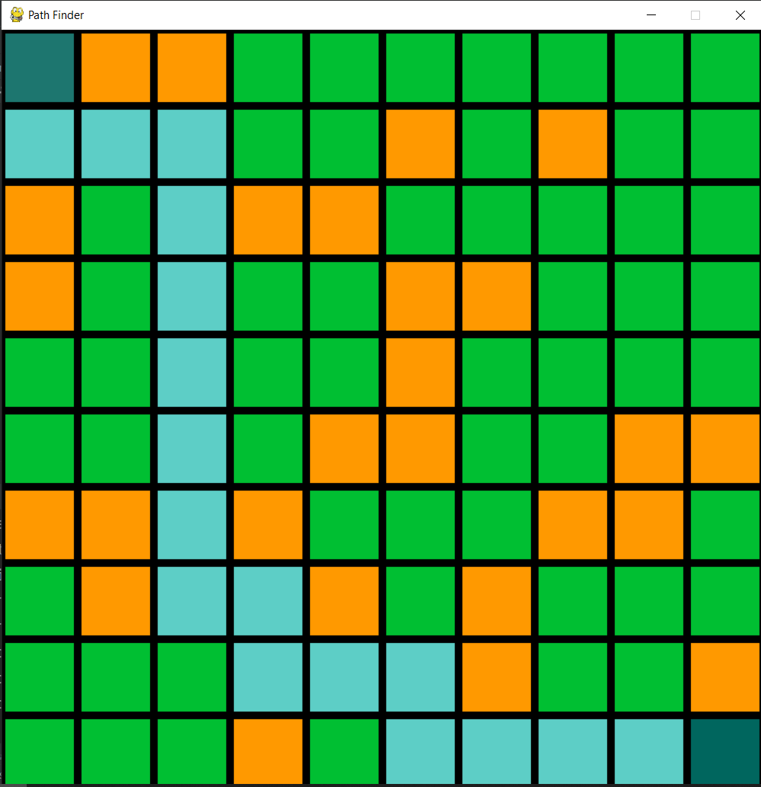
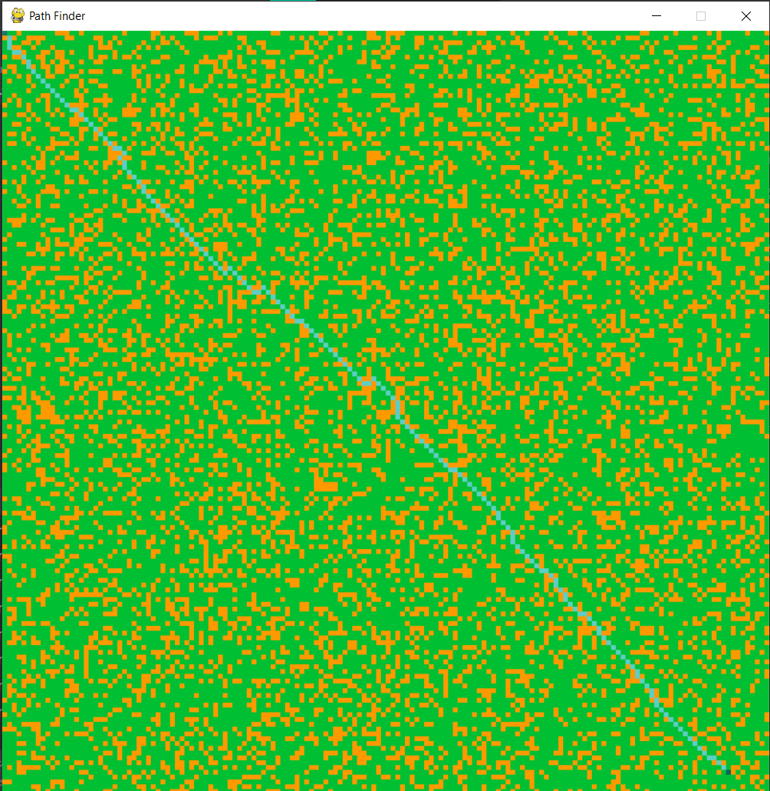

# Breadth First Search Pathfinding Visualization

Small app to experiment with pathfinding.

### Installation and use
Clone repo: `git clone https://github.com/AndreSamusenko/pathFinder`

Install poetry to get requirements automatically: `pip install poetry `

Run poetry:` poetry install`
(or use requirements.txt)

Run main.py: `python main.py`

### App navigation
Use keyboard to switch modes and settings:

##### Keyboard:

###### Modes:

• 1 - Replace finish vertex

• 2 - Replace start vertex

• 3 - Add obstacles

• 4 - Delete obstacles

###### Settings:

• 5 - Show edges

• 6 - Randomize map

• 7 - Increase cells number

• 8 - Decrease cells number

• 9 - Use or not diagonal directions

##### Mouse:

Left key press on cells - make action with cell in selected mode

### Preview pictures

